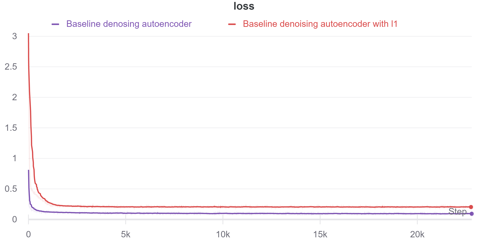
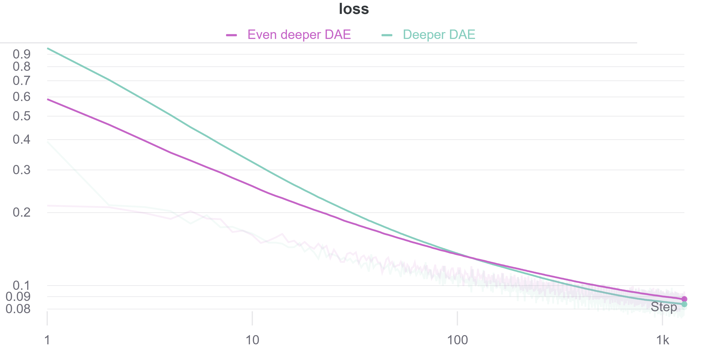
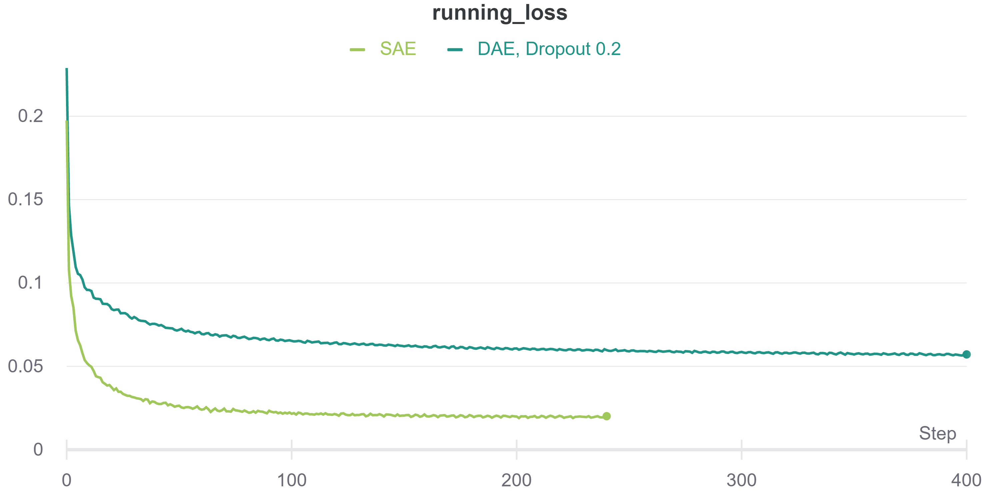
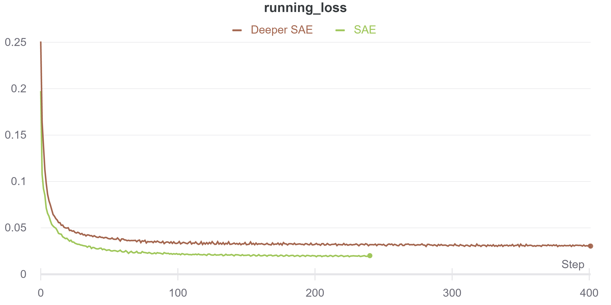
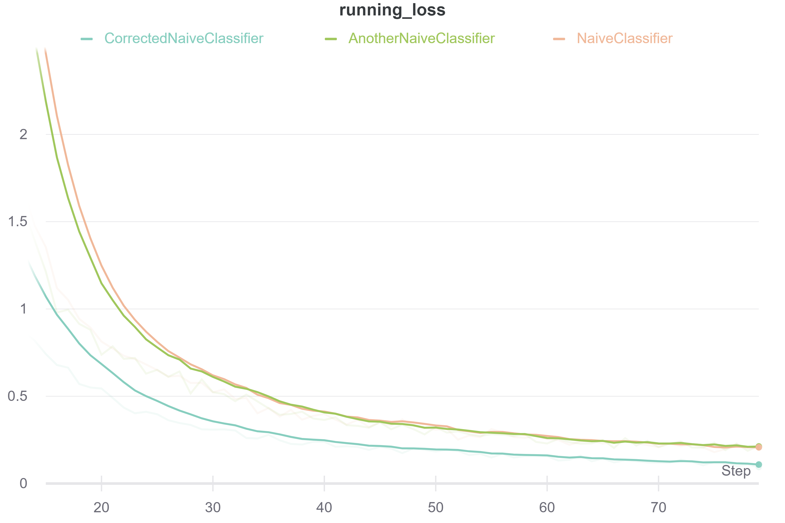
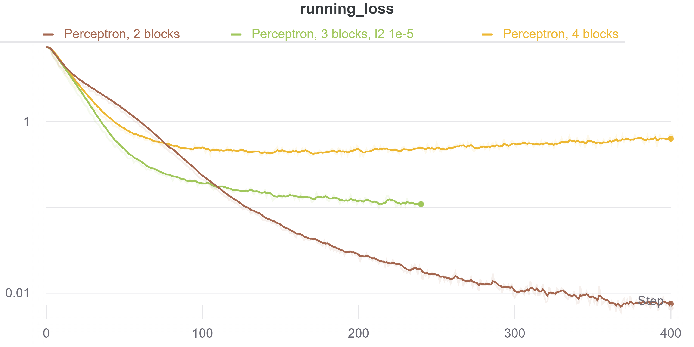
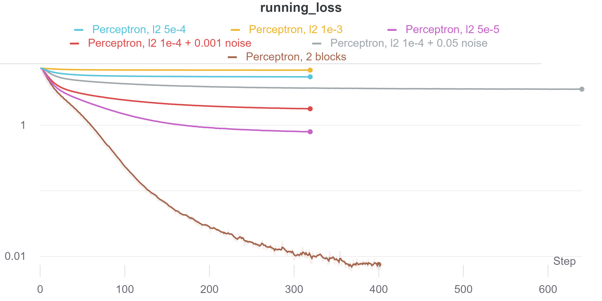
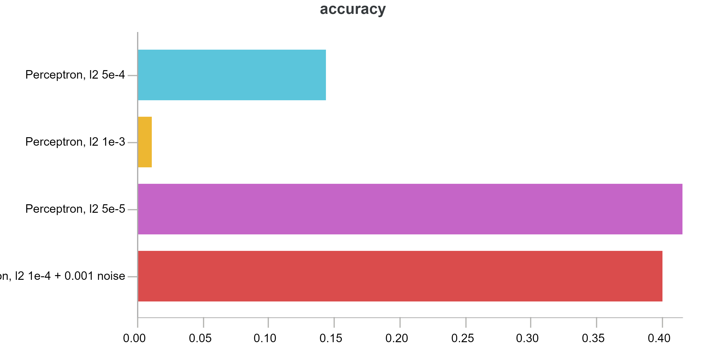

# Отчёт по первому домашнему заданию

## Задача 1: написать автоэнкодер

Мне было скучно, поэтому с начала я решил совместить идею denoising и sparse autoencoder-ов. Для этого я взял простейшую модель denoising autoencoder-а, которая была приведена на семинаре, и навесил на неё l1-регуляризацию. Однако это оказалось не очень хорошей идеей.

Результаты на тесте тоже оказались хуже.

После этого я попробовал увеличить глубину простого denoising autoencoder-а.

Это график в log-log-scale.
Модели показывали схожее качество, причём более глубокий вариант учился сначала быстрее, но потом стал несколько хуже - скорее всего, из-за переобучения.

Model | Train loss | Test loss
---|---|---
Deeper DAE | 0.08134 | 0.04816
 Even deeper DAE| 0.0884 | 0.05229

Лучше себя показала модель Deeper DAE - с 8 denoising-блоками.

На тесте обе модели показывали результат лучше, чем на трейне.
Это навело на мысль, что наложенная регуляризация слишком сильная, и её можно ослабить.
Я уменьшил параметр Dropout-а с 0.3 до 0.2. После этого результаты снова улучшились:

Model | Train loss | Test loss
---|---|---
 Deeper DAE, Dropout 0.3 | 0.08134 | 0.04816
 Deeper DAE, Dropout 0.2 | 0.05714 | 0.03146

Наверное, любой нормальный человек пошел бы тут выкручивать дропаут ещё пониже, но я решил попробовать sparse autoencoder.

Видимо, удачно удалось подобрать коэффициент для l1-регуляризации - ошибка на трейне почти в три раза меньше.
Ошибка на тесте была равна 0.02 уже после 20 эпох, и ещё 40 эпох не поменяли ситуацию.
Денойзинг автоэнкодеру удалось выйти на 0.03 только после 100 эпох.

Model | Train loss | Test loss
---|---|---
Deeper DAE, Dropout 0.2 | 0.05714 | 0.03146
 Sparse AE | 0.02008 | 0.2097

После этого я попробовал добавить слоёв в SAE, но прироста качества это не дало.

Model | Train loss | Test loss
---|---|---
 SAE | 0.02008 | 0.02097
 Deeper SAE | 0.03040 | 0.03732

По итогам моих экпериментов лучше всего работает sparse autoencoder небольшой глубины (9 блоков "свёртка-нормализация-активация" в энкодере и 8 - в декодере.)

## Задача 2: написать классификатор, обучить его на MNIST, посчитать с его помощью FID

Классифицировать MNIST довольно легко - первая же свёрточная нейросеть, написанная от руки по стандартному шаблону (несколько свёрточных блоков и пара полносвязных слоёв с дропаутом между ними) выдаёт примерно 0.995 accuracy на тесте.

Способ реализации FID взят с семинара.

Не знаю, что ещё можно написать в этом разделе.

## Задача 3: попробовать честную классификацию, довести до нормального качества

Используя ту же архитектуру на Omniglot, можно получить accuracy порядка 0.6 - 0.65.

Model | Train loss | Test accuracy
---|---|---
 Naive Classifier | 0.2055 | 0.62
 Another Naive Classifier| 0.2157 | 0.60
 Corrected Naive Classifier | 0.0941 | 0.65

Я не сохранял веса для классификатора на Омниглоте, поэтому тут есть два почти одинаковых графика для одной и той же модели.
Также сначала я не поставил активацию между полносвязными слоями.
Это сделало потери на тренировке больше, но результат классификации улучшился незначительно.

## Задача 4: Обучить модель классификации на латентных представлениях

С обучением бустингов и лесов возникли проблемы, поэтому я решил попробовать полносвязные сети.

На этом графике можно видеть потери на тренировке у перцептронов с разным количеством блоков (в log-scale)

Я решил подобрать регуляризационную константу для перцептрона из двух блоков.

Однако почему-то чем сильнее была регуляризация, тем хуже были результаты на тесте.

Лучший результат, которого удалось достигнуть - примерно 0.45 accuracy на тесте.
Для этого я обучал перцептрон из двух блоков с l2 регуляризацией сначала с коэффициентом 0.0001, а затем
с коэффициентом 0.00005.

Что касается бустингов и леса - ошибку в своих действиях я так и не нашёл. Нормализация, подбор параметров прироста практически не давали. Потом я подумал, что у меня слишком высокая размерность латентного пространства - т.к. я использовал Sparse Autoencoder,
я оставил его довольно большим, размерности 1024. Однако снижение размерности до 128 и 32 тоже не помогло. Надеюсь, потом смогу разобраться, что сделал не так.
